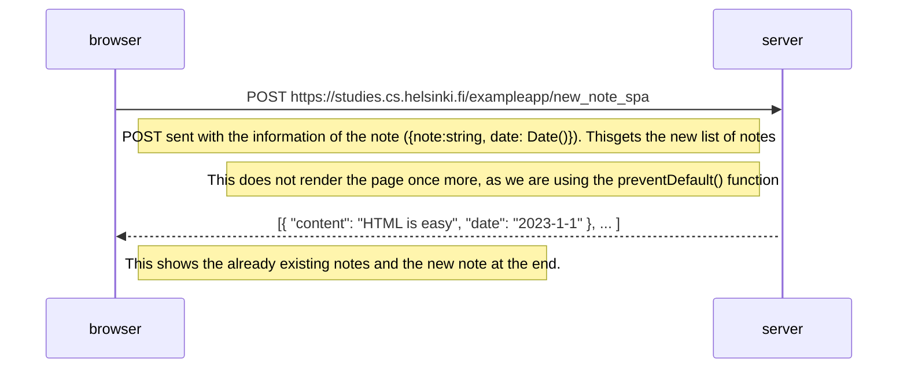

```mermaid
sequenceDiagram
participant browser
participant server

    browser->>server: POST https://studies.cs.helsinki.fi/exampleapp/new_note_spa
    activate server
    Note left of server: POST sent with the information of the note ({note:string, date: Date()}). Thisgets the new list of notes
    Note left of server: This does not render the page once more, as we are using the preventDefault() function
    server-->>browser: [{ "content": "HTML is easy", "date": "2023-1-1" }, ... ]

    Note right of browser: This shows the already existing notes and the new note at the end.

```
